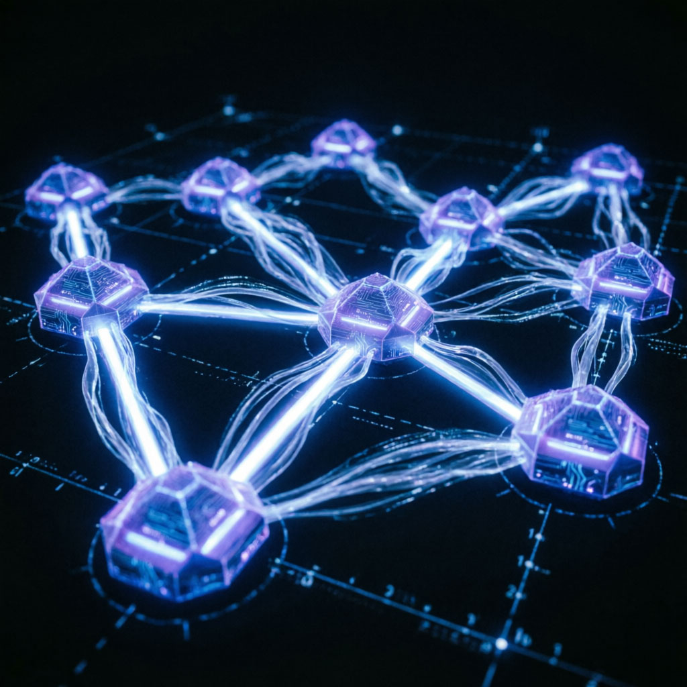

# 🛡️ Cybersecurity Fields Overview

 

This section introduces participants to the fundamentals of cybersecurity, including its history, real-world incidents, importance, and major career paths in the field.

## 📜 Historical Introduction to Cybersecurity

Cybersecurity has evolved significantly over the years, especially with the rise of digital infrastructure and global connectivity. Cyber warfare has become a critical part of modern conflicts, targeting governments, organizations, and individuals.

---

## ⚔️ Cybersecurity Wars & Real Incidents

### 1. Stuxnet – The First Cyber Weapon

The **Stuxnet worm** is considered the first cyber weapon in history.
It exploited vulnerabilities in Microsoft Windows and industrial control systems to target Iranian nuclear facilities.

* Destroyed around 1,000 centrifuges
* Disrupted Iran’s nuclear program
* Marked the beginning of cyber warfare at a national level

---

### 2. Social Engineering Attacks (2013–2014)

A group believed to be affiliated with Hezbollah/Iran targeted Syrian opposition members using **social engineering techniques**:

* Fake identities (posing as women on Skype)
* Sending malicious files (RAT – Remote Access Trojan)
* Stealing conversations, military plans, and sensitive documents

---

### 3. Syrian Government Account Breach (March 2026)

Official accounts of the new Syrian government on platform X were hacked:

* Pro-Israel messages were posted
* Account names were altered
* The goal was to damage public image during regional tensions

---

### 4. Bangladesh Bank Heist (2016)

One of the largest cyber heists in history:

* Hackers targeted the Bangladesh Central Bank via the SWIFT system
* Attempted to steal $1 billion
* Successfully stole $81 million before detection

---

## 👤 Personal Cybersecurity Stories

Real-life examples that highlight everyday risks:

* 🎣 Phishing email scam
* 🔑 Weak password compromise
* 📱 Mobile device hacking
* 📶 Public Wi-Fi attacks

---

## 🔐 What is Cybersecurity?

Cybersecurity is the practice of protecting digital systems (computers, networks, applications, and data) from cyberattacks and unauthorized access.

It ensures:

* Data confidentiality
* System integrity
* Service availability

---

## ⭐ Importance of Cybersecurity

### 1. Protecting Sensitive Data

* Individuals: personal data, banking info, private photos
* Organizations: business secrets, customer databases

---

### 2. Business Continuity

Cyberattacks like ransomware can shut down operations.
Cybersecurity helps ensure quick recovery and minimal downtime.

---

### 3. Protection Against Advanced Threats

With the rise of AI, cyberattacks are becoming faster and more complex.
Cybersecurity enables early detection and prevention.

---

### 4. National Security & Critical Infrastructure

Countries rely on digital systems for:

* Electricity
* Water
* Healthcare

Cybersecurity protects these critical systems from sabotage and espionage.

---

### 5. Building Digital Trust

Secure systems increase user confidence in:

* Online services
* E-commerce
* Government platforms

---

## 🧩 Cybersecurity Fields

Cybersecurity is divided into two main areas:

 

---

# 🔴 Red Team (Offensive Security)

The Red Team simulates real-world attacks ethically to identify vulnerabilities before attackers exploit them.

### 1. Web Penetration Testing

Testing websites and applications for vulnerabilities:

* SQL Injection
* Cross-Site Scripting (XSS)

---

### 2. Malware Development

Creating malware in controlled environments to understand attacks:

* Keyloggers
* Backdoors
* Experimental ransomware

---

### 3. Network Penetration Testing

Testing internal and external networks:

* Identifying open ports
* Detecting weak devices
* Exploiting vulnerabilities

---

### 4. Reverse Engineering

Analyzing software to understand how it works internally:

* Malware analysis
* Detecting backdoors
* Understanding attack behavior

Requires knowledge of:

* Programming
* Assembly
* Operating Systems

---

### 5. Social Engineering

Exploiting human behavior instead of systems:

* Phishing emails
* Fake support calls
* USB attacks

---

### 6. OSINT (Open Source Intelligence)

Collecting publicly available information before attacks:

* Emails
* Employee names
* Technologies used

---

# 🔵 Blue Team (Defensive Security)

The Blue Team focuses on protecting systems, detecting threats, and responding to incidents.

---

### 1. SOC (Security Operations Center)

A 24/7 monitoring center that:

* Detects threats
* Analyzes incidents
* Responds in real-time

---

### 2. Threat Hunting

Proactively searching for hidden threats that bypass security tools.

---

### 3. Digital Forensics

Investigating cyber incidents and collecting legal evidence.

---

### 4. Incident Response

Handling attacks efficiently to:

* Minimize damage
* Restore systems quickly

---

### 5. Malware Analysis

Studying malicious files to:

* Understand behavior
* Identify threats (IOCs)
* Improve defenses

---

## 🧪 Practical Section

At the end of this corner, participants completed a **quiz** designed to:

* Evaluate their understanding
* Identify their strengths
* Help them choose the most suitable cybersecurity field
### 🔗 [Link](https://gemini.google.com/share/edd8b2317cbf)
---

## 🎯 Conclusion

This corner provided a comprehensive introduction to cybersecurity, combining theory, real-world cases, and practical insights to help participants explore the field and choose their path.

## 🔗 Contributor 

- **Maryam Abd Alfattah** 🔗 [Linkedin](https://www.linkedin.com/in/maryam-abd-alfattah-50691b242/)
- **Sara Alrifai Aboulibada** 🔗 [Linkedin](https://www.linkedin.com/in/sara-alrifai-aboulibada-0396a9268)
- **Dania Salama** 🔗 [Linkedin](https://www.linkedin.com/in/dania-salama-286294228/)
