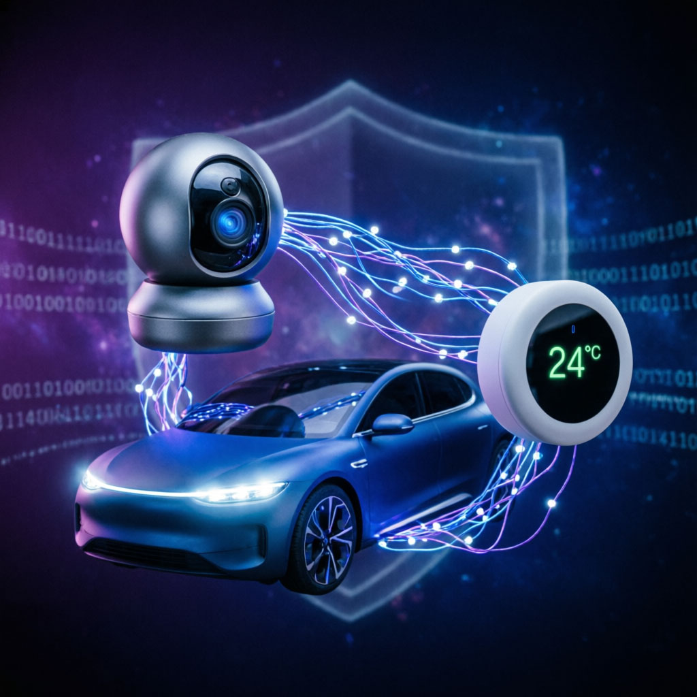

# 🌐 IoT (Internet of Things) Security

 

## 📌 Introduction

The **Internet of Things (IoT)** connects everyday devices to the internet:

* Smart home devices (cameras, lights, assistants)
* Smart cars
* Medical devices
* Industrial systems
* Smart city infrastructure

While IoT makes life easier, it also introduces **serious security risks**.

---

## 🧠 What is IoT Security?

**IoT Security** focuses on protecting connected devices and networks from:

* Unauthorized access
* Data leaks
* Remote control by attackers
* Large-scale cyberattacks

---

## ⚠️ Why IoT is Dangerous

Many IoT devices are:

* Poorly secured
* Using default passwords
* Rarely updated
* Always connected to the internet

👉 This makes them easy targets for attackers.

---

## 🧩 Common IoT Threats & Real Cases

### 1. 🤖 Botnets & IoT Devices 

**Concept:** Infected IoT devices can be turned into botnets.

📍 **Case Study – Mirai Botnet**

* Infected cameras and routers
* Launched massive DDoS attacks
* Took down major internet services

---

### 2. 🏠 Smart Home Vulnerabilities 

**Concept:** Weak authentication exposes home devices.

📍 **Case Study – Ring Camera Hack**

* Attackers accessed cameras
* Violated user privacy

---

### 3. 🚗 Hacking Smart Cars 

**Concept:** Remote control of connected vehicles.

📍 **Case Study – Jeep Cherokee**

* Remote control of steering and brakes

---

### 4. 🏥 Medical IoT Risks 

**Concept:** Vulnerabilities in healthcare devices.

📍 **Case Study – Insulin Pump**

* Remote manipulation of dosage

---

### 5. 🏭 Industrial IoT 

**Concept:** Attacks on industrial systems.

📍 **Case Study – Stuxnet**

* Physical damage to infrastructure

---

### 6. 🏙️ Smart City Security 

**Concept:** Risks in city infrastructure.

📍 **Case Study – Traffic Lights Hack**

* Manipulation of traffic systems

---

### 7. 🔑 Default Password Problem 

**Concept:** Devices shipped with weak credentials.

📍 **Case Study – Mirai Scanner**

* Exploited default passwords like `admin/admin`

---

### 8. 👶 Privacy Attacks 

**Concept:** Cameras and monitors can be hacked.

📍 **Case Study – Baby Monitor Hack**

* Unauthorized access to live feeds

---

### 9. ⚙️ Firmware Vulnerabilities 

**Concept:** Lack of updates leads to exploitation.

---

### 10. ⚡ Critical Infrastructure 

**Concept:** Attacks on essential services.

📍 **Case Study – Power Grid Attack**

* Disrupted electricity for thousands

---

## 🧪 Practical Demonstrations

During this corner, participants experienced **real-world attack scenarios**:

### 📷 IP Camera Hacking Demo

* Demonstrated how insecure IP cameras can be accessed
* Showed risks of:

  * Weak/default passwords
  * Open ports
* Highlighted how attackers can:

  * View live feeds
  * Control devices remotely

---

### 📡 Evil Twin Attack (ESP32 Demo)

* Used an **ESP32 device** to create a fake Wi-Fi network (Evil Twin)
* Simulated how attackers clone legitimate networks

Participants learned how attackers can:

* Trick users into connecting to fake Wi-Fi
* Intercept traffic
* Perform phishing or data capture

---

### 🌐 Open Wi-Fi Risks Awareness

Explained the dangers of public/open networks:

* Data interception (Man-in-the-Middle attacks)
* Session hijacking
* Credential theft

---

## ⚠️ Key IoT Security Problems

* Weak/default passwords
* Lack of firmware updates
* No encryption
* Poor authentication
* Exposure to network-based attacks

---

## 🛡️ How to Protect Yourself

### 👤 For Users

* Change default passwords immediately
* Keep devices updated
* Avoid connecting to unknown Wi-Fi networks
* Disable unnecessary features

---

### 👨‍💻 For Developers

* Enforce strong authentication
* Encrypt communications
* Provide regular updates
* Secure network communication

---

## 🎯 Key Takeaways

1. IoT devices are highly vulnerable if not secured
2. Real attacks can be simple but very impactful
3. Public Wi-Fi is a major risk factor
4. Awareness is the first step to protection

---

## 📢 Conclusion

IoT security is not just theoretical—it affects **real devices and real lives**.

Through practical demonstrations, participants saw how easily insecure devices and networks can be exploited.

**Secure your devices. Think before you connect.**

## 🔗 Contributors :
- **Jamal Al Midani** 🔗 [Linkedin](https://www.linkedin.com/in/jamal-al-midani-067366359/)
- **Izzat Kawadri** 🔗 [Linkedin](https://www.linkedin.com/in/izzat-kawadri/)
